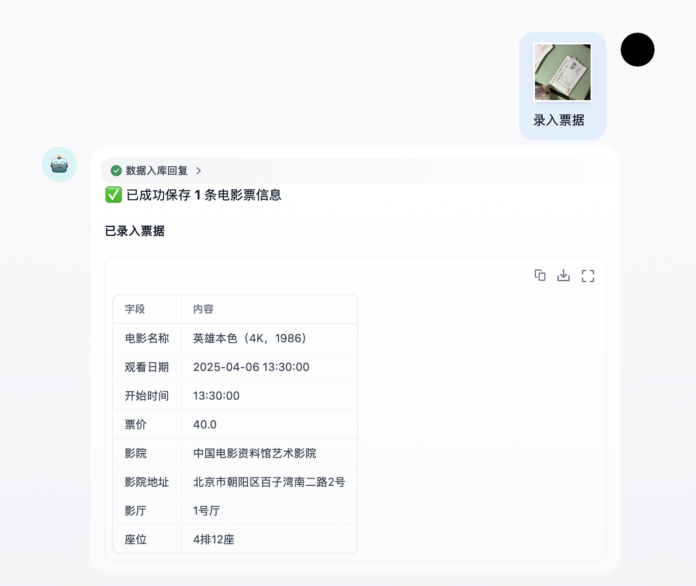
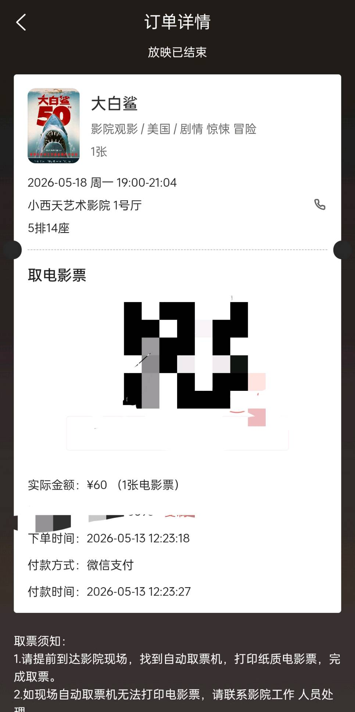
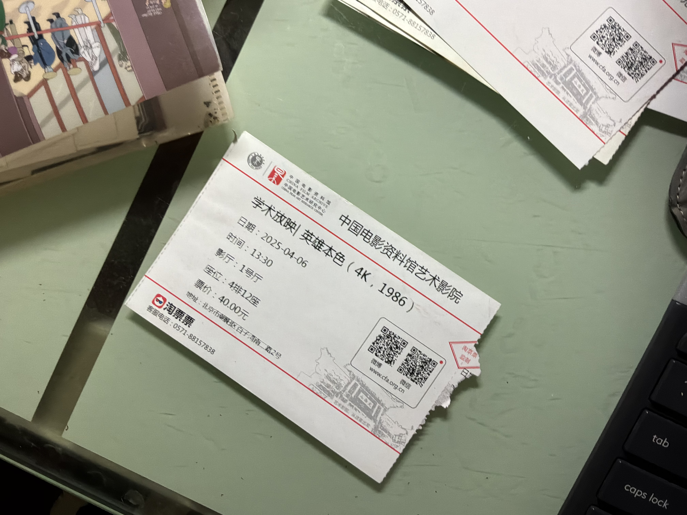
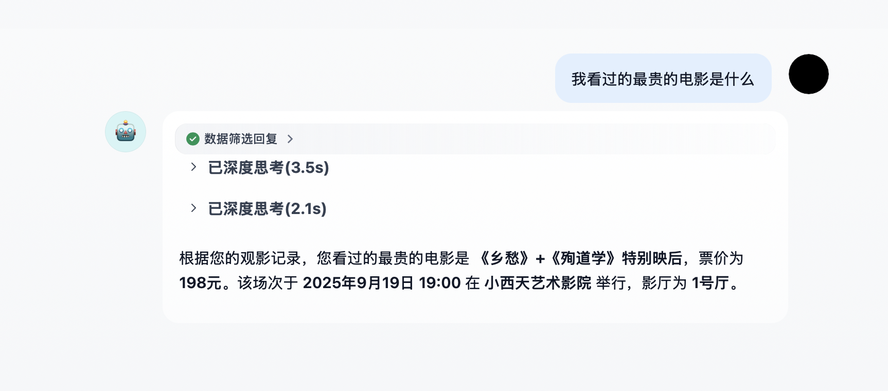
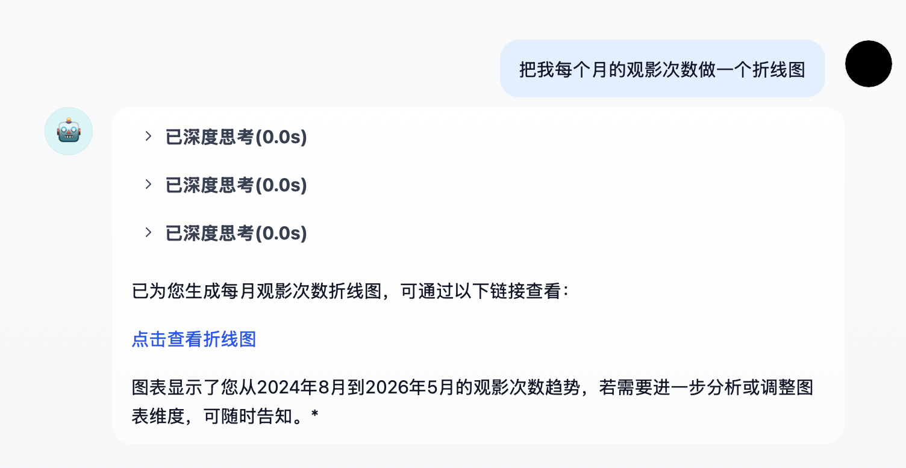
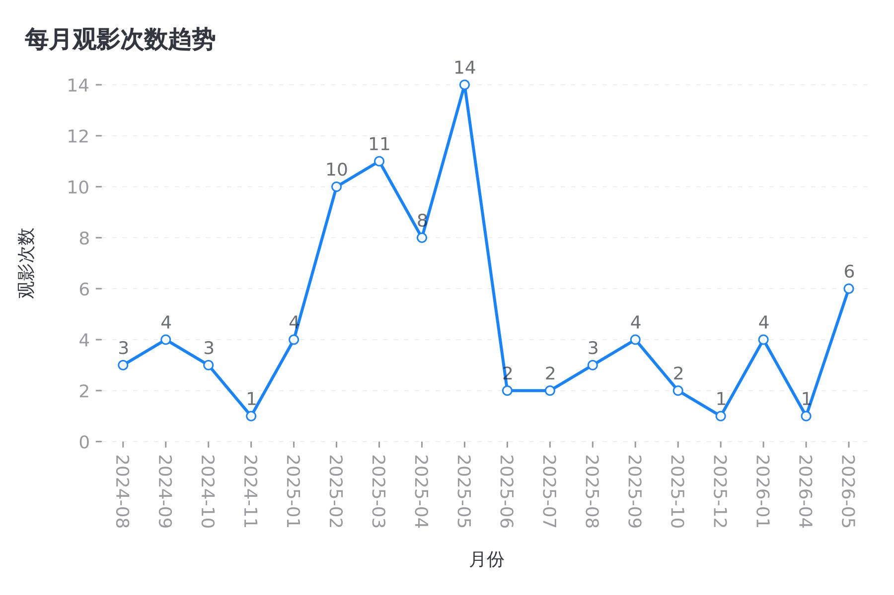

# 🎫 中国电影资料馆智能票据助手

## 📖 一、简介

中国电影资料馆由于放映的多为商业影院所没有的经典电影，且往往是独家修复版，影片质量高，电影映后、映前活动众多，深受影迷喜爱。然而，观影数量大，导致票据管理成为一大问题。中国电影资料馆现有电影票的形式有电子票和纸质票，电子票只作为取票凭证，实际入场需要纸质票。电子票和纸质票均提供了丰富的信息（如影片名称、观影时间、票价、影院地址、座号等），但大多数情况下，影迷往往只是把电子票据用于取纸质票，纸质票收藏到票价中，没有利用丰富的票面信息和数量众多的票据形成自己的观影数据库，进而实现观影记录智能查询（例如查询看过的票价最贵或者时间最长的电影），或者根据观影记录形成可视化报表。


**技术栈**：Dify Workflow（视觉识别）+ FastAPI（ticket-api）+ MySQL；可选 Langbot 接入飞书。

**适用票种**：

| 类型 | 识别字段 |
|------|----------|
| 电子票 | 电影名、日期、时间、影院、影厅、支付状态、价格 |
| 纸质票 | 电影名、日期、影院地址、影厅、座位、票价 |

---

## ✨ 二、功能详解

### 🎬 1. 票据识别



**票据样例**

| 电子票截图 | 纸质票 |
|----------|--------|
|  |  |

- 上传图片，多模态 LLM 提取票据信息，用JSON格式传给后端。
- 后端校验字段格式；校验通过后将各字段信息写入本地数据库。

### 🔍 2. 数据查询



- 票夹记录持久化在本地数据库中。
- 构建了具有SQL查询工具的智能体，能够根据用户查询要求，生成对应的SQL语句查询。

### 📊 3. 报表生成





- 检测到用户报表生成的消息后，Agent会先调用SQL查询工具获取所需要的数据。
- 基于查询结果，Agent使用图表生成工具生成可视化图表，目前支持柱状图、面积图、折线图等25种图表的生成。

---

## 🚀 三、使用方式

### 🤖 1. Dify 部署

**第一步：启动数据服务**

```bash
git clone https://github.com/m4rklee/movie_tickets_assistant.git
cd movie_tickets_assistant
docker compose up -d
```

- API 文档：<http://localhost:8000/docs>
- MySQL 端口：`3307`（容器内库名 `filmarchive_wallet`）

**第二步：配置 Dify**

1. 安装 [Dify](https://github.com/langgenius/dify)（建议 ≥ 1.6），并配置视觉模型 API Key。
2. 按 [workflow/README.md](workflow/README.md) 创建两个 Workflow：
   - **ParseTicket**：识别并创建草稿
   - **ConfirmTicket**：确认后入库
3. Prompt 与代码节点见 [workflow/prompts.md](workflow/prompts.md)、[workflow/code/](workflow/code/)。
4. 应用环境变量：

| 变量 | 示例值 |
|------|--------|
| `TICKET_API_BASE` | `http://host.docker.internal:8000` |
| `TICKET_API_KEY` | `dev-local-key` |

> Dify 运行在 Docker 内时，用 `host.docker.internal` 访问宿主机上的 ticket-api。

**第三步：评测（可选）**

将脱敏票样放入 `eval/cases/*/ticket.jpg`，更新 `expected.json` 后参考 [eval/README.md](eval/README.md) 跑分。

### 💬 2. 接入飞书


在 Dify + ticket-api 跑通后，通过 [Langbot](https://github.com/RockChinQ/LangBot) 将能力接到飞书：

1. 飞书自建应用（机器人、消息与卡片权限）。
2. Langbot 接收用户图片 → 调用 Dify `ParseTicket` API → 推送识别卡片。
3. 用户点击确认 → 调用 `ConfirmTicket` → 回复入库结果。

详细步骤、状态机与配置模板见 [docs/v2-langbot-feishu.md](docs/v2-langbot-feishu.md)、[langbot/feishu-ticket-wallet.example.yaml](langbot/feishu-ticket-wallet.example.yaml)。

---

## 📚 文档索引

| 文档 | 说明 |
|------|------|
| [docs/PRD.md](docs/PRD.md) | 产品需求 |
| [docs/workflow-design.md](docs/workflow-design.md) | 架构设计 |
| [docs/data-dictionary.md](docs/data-dictionary.md) | 字段与 API 契约 |
| [docs/v3-qa-reports.md](docs/v3-qa-reports.md) | 问答与报表扩展 |

## 📄 许可

个人学习与作品集用途；票样图片请脱敏，勿提交含订单号/手机号的原图。
