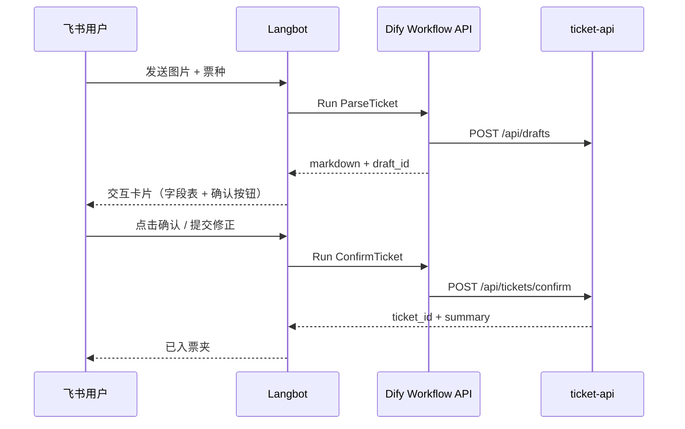

# v2：Langbot 接入飞书

## 目标

在飞书中完成：发送票图 → 识别预览 → 点击确认 → 入库，无需打开 Dify 控制台。

## 架构



## 前置

- MVP 已跑通：`ParseTicket`、`ConfirmTicket`、ticket-api
- 飞书企业自建应用（机器人 + 消息与卡片权限）
- [Langbot](https://github.com/RockChinQ/LangBot) 已部署并可访问 Dify API

## Dify API

1. 在 Dify 应用「API 访问」中创建 API Key
2. 记录 Workflow ID：
   - `ParseTicket` → `PARSE_WORKFLOW_ID`
   - `ConfirmTicket` → `CONFIRM_WORKFLOW_ID`
3. 运行接口（示例）：

```bash
curl -X POST 'https://<dify-host>/v1/workflows/run' \
  -H 'Authorization: Bearer <DIFY_API_KEY>' \
  -H 'Content-Type: application/json' \
  -d '{
    "inputs": {
      "ticket_type": "electronic",
      "ticket_image": [
        {
          "type": "image",
          "transfer_method": "local_file",
          "upload_file_id": "<DIFY_FILE_ID>"
        }
      ]
    },
    "response_mode": "blocking",
    "user": "feishu-<open_id>"
  }'
```

飞书图片需先转为 Dify 可接受的文件输入。推荐流程：

1. Langbot 从飞书下载图片二进制。
2. 调 Dify `POST /v1/files/upload` 上传图片，表单字段包含 `file` 和同一个 `user`。
3. 取上传响应里的 `id`，作为工作流入参 `ticket_image[0].upload_file_id`。

如果使用可公网访问的图片 URL，也可以把文件对象改为：

```json
{
  "inputs": {
    "ticket_type": "electronic",
    "ticket_image": [
      {
        "type": "image",
        "transfer_method": "remote_url",
        "url": "https://example.com/ticket.jpg"
      }
    ]
  },
  "response_mode": "blocking",
  "user": "feishu-<open_id>"
}
```

注意：`ticket_image` 是文件类型变量，在 Workflow API 中按文件列表传入；不要传成普通字符串、飞书 `image_key`，也不要只传单个对象。

## 常见报错

### `{"error":"No image provided."}`

这个错误说明 Dify 工作流里负责识图的节点没有拿到图片。若后端日志显示：

```text
====== RAW BODY START ======
{"error":"No image provided."}
POST /save_movie_tickets 400 Bad Request
```

含义通常不是 MySQL 后端缺图片，而是 Langbot 调 Dify 时没有把飞书图片转换成 Dify 文件输入，Dify 产出了错误对象，随后 HTTP 节点又把这个错误对象转发到了后端。

排查顺序：

1. 确认 Langbot 拿到的飞书图片不是 `image_key`，而是已下载的图片二进制或公网 URL。
2. 若是二进制图片，先调用 Dify `/v1/files/upload`，确认响应里有 `id`。
3. 调 `/v1/workflows/run` 时，确认 `inputs.ticket_image` 是数组，且 `upload_file_id` 等于上一步返回的 `id`。
4. Dify 工作流开始节点变量名必须叫 `ticket_image`，类型必须是「文件 / 图片」。
5. LLM 节点必须开启 Vision，并把图片变量绑定为 `ticket_image`。

## Langbot 配置要点

配置目录参考：`langbot/config.yaml`（路径以 LangBot 版本为准）。

| 项 | 建议 |
|----|------|
| 触发词 | `票夹` / `入库` / 自动识别图片消息 |
| 会话状态 | `idle` → `await_confirm`（保存 draft_id） |
| Parse 回调 | 解析 Workflow 输出中的 `draft_id` 与 Markdown |
| 卡片 | 飞书消息卡片展示字段 + 「确认入库」「取消」 |
| 修正 | 用户回复 JSON 或按字段逐条纠正 → 填入 `corrected_json` |
| Confirm | 调用 ConfirmTicket，`inputs.draft_id` + 可选 `corrected_json` |

## 示例状态机（伪代码）

```python
# on_image_message
result = dify.run(PARSE_WORKFLOW_ID, ticket_type=infer_or_ask(), ticket_image=uploaded)
session.draft_id = result.draft_id
send_feishu_card(result.markdown, actions=["confirm", "cancel"])

# on_confirm
dify.run(CONFIRM_WORKFLOW_ID, draft_id=session.draft_id, corrected_json=session.corrections)
session.clear()
```

## 安全

- ticket-api `X-API-Key` 仅 Langbot 服务端持有，不下发客户端
- 飞书事件 URL 校验 Token
- 票图存储路径不可公网暴露

## 验收

- [ ] 飞书发电子票截图 → 返回识别表 + draft_id
- [ ] 点确认 → 返回 ticket_id，`GET /api/tickets` 可查
- [ ] 重复票显示 duplicate_warning
- [ ] 取消不调用 Confirm

## 配置模板

见 [langbot/feishu-ticket-wallet.example.yaml](../langbot/feishu-ticket-wallet.example.yaml)。
