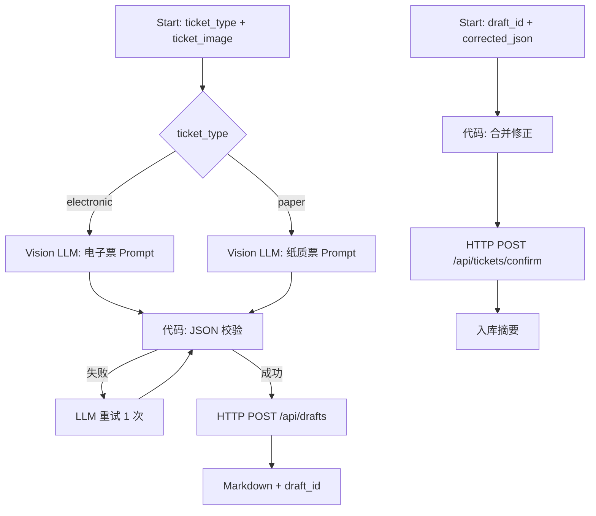

# FilmArchive Ticket Wallet — Dify 工作流设计

## 架构（MVP）

## Workflow A：ParseTicket

### 开始节点变量

| 变量名 | 类型 | 必填 |
|--------|------|------|
| `ticket_type` | 下拉：`electronic` / `paper` | 是 |
| `ticket_image` | 图片 | 是 |

### 节点要点

1. **IF/ELSE**：按 `ticket_type` 分流到不同 System Prompt（见 [workflow/prompts.md](../workflow/prompts.md)）
2. **LLM**：开启 Vision，传入 `ticket_image`；temperature 0.2
3. **代码**：剥离 markdown 代码块 → `json.loads` → 必填字段检查
4. **HTTP Request**：`POST {{#env.TICKET_API_BASE#}}/api/drafts`，Body 见 data-dictionary
5. **结束**：输出确认用 Markdown 表格

### 环境变量（Dify 应用级）

| 名 | 示例 |
|----|------|
| `TICKET_API_BASE` | `http://host.docker.internal:8000` |
| `TICKET_API_KEY` | 与 `.env` 一致 |

## Workflow B：ConfirmTicket

### 开始节点变量

| 变量名 | 类型 | 必填 |
|--------|------|------|
| `draft_id` | 数字 | 是 |
| `corrected_json` | 段落文本（JSON 字符串） | 否 |

### 节点要点

1. **代码**：解析 `corrected_json`（空则仅传 draft_id）
2. **HTTP**：`POST /api/tickets/confirm`
3. **结束**：展示 `ticket_id`、去重警告、字段摘要

## v2 迭代（飞书）

Langbot 调用 Dify Workflow API，不修改上述节点逻辑。见 [v2-langbot-feishu.md](./v2-langbot-feishu.md)。

## v3 迭代（问答 / 报表）

- **TicketQA**：Chatflow + HTTP 工具 `GET /api/tickets`
- **TicketReport**：Workflow + `GET /api/reports/summary`

见 [v3-qa-reports.md](./v3-qa-reports.md)。
